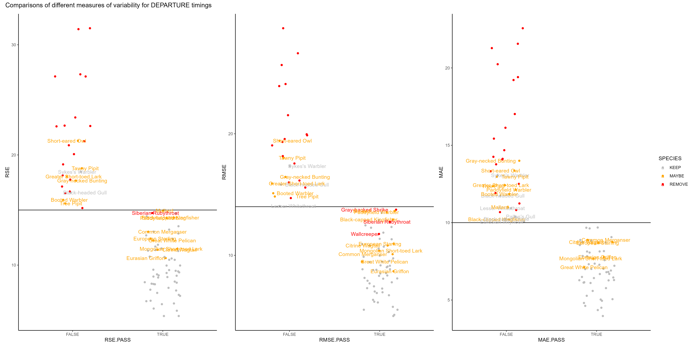

```{r setup, include=FALSE}
library(tidyverse)
library(glue)
library(lubridate)
library(patchwork)
library(vegan)


source("scripts/functions.R")

theme_set(theme_classic())

# migration_palette <- c("#1B9E77", "#E89005", "#EF4050", "#9678B6")

knitr::opts_chunk$set(echo = FALSE, warnings = FALSE, 
                      messages = FALSE, cache.lazy = FALSE)

```

```{r data_filt, cache=FALSE}

# rawpath <- "data/ebd_IN_relFeb-2022.txt"
# senspath <- "data/ebd_sensitive_relDec-2021_IN.txt"
# groupaccspath <- "data/ebd_users_GA_relDec-2021.csv"

# load("data/ebd_IN_relJan-2022.RData")

# # processing the data for current use (34 mins) # ~ 2h on 2024
# data <- data_process(rawpath, senspath, data) 

# # cleaning and filtering for data quality (7 mins)
# data <- dataqual_filt(data, groupaccspath, maxvel = 20, minsut = 2)


# # prepare dataset with species and metrics of interest 
# prep_data_spec(data)


load("data/dataforanalysis.RData")


if(!dir.exists("02_explor_figs/")) {
  dir.create("02_explor_figs/", recursive = TRUE)
}

```

# Introduction

- Relationship between migration timings and latitude has received some attention, such as: In breeding ranges, how does latitude influence the migrant proportion of bird populations? i.e. whether or not a breeding bird migrates south. 
- Studies on *when* migration occurs:
    - Either on effect of breeding latitudes
    - Various other env. variables affect migration timing, and how this changes with climate change [@saino2004, @gordo2005]
    - Or asking how wintering latitudes affect timing of arrival in breeding grounds
        - Species wintering in higher/temperate latitudes migrate (arrive in breeding range) earlier than tropical wintering ones. Breeding latitude does not have an effect. [@hagan1991]
- Synchronicity of migration itself has received very little attention
    - But from @hagan1991 we can retain the notion of synchronicity. According to those findings, the greater the latitudinal range occupied by a species in winter, the more asynchronous its migration will be. 
    - The reality, and what we can see in our prelim explorations, is a bit more complex than that, of course. Not a linear relationship.
    - But what exactly is the relationship between migration timings (special focus on synchronicity) and wintering latitudes (minima, median, breadth)? And what does the relationship imply ecologically?
    - Also related to Zugunruhe, as suggested for *Phylloscopus* [@akesson2017]
    - Longer-distance migrants more synchronous [@winger2024]

Most migration studies heavily physiological, while our aim with this is more functional (traits-based). Macroecological perspective on seasonal flux of animal movement (different from tracking studies), allowing cross-species comparisons of broad-scale strategies in pace and geography of annual cycle stages. 

We also have certain species whose entire global population winters in India (e.g., Blyth's Reed Warbler, Greenish Warbler). This is a good opportunity to gain understandings of global ecological (and conservation) significance. 

## Questions

1. Cross-species comparisons:
    1. Does winter arrival/departure timing depend on the species’s wintering latitude?
    1. Does winter migration synchronicity depend on the species’s wintering latitude?
    1. Do species migrating later in season tend to migrate more synchronously?
    1. Is winter arrival/departure timing changing over the years (climate change)? 
        - *As a final section, if relevant and feasible (low data, quantile method might fail.).*
        - Or, instead can maybe try to correlate with temperature gradient across latitudes to speculate.
1. Within-species comparisons:
    1. Do species follow same synchronicity strategy for arrival and departure? (Symmetricity, see @winger2024)
        1. Which do, and which don't (what determines this)?
    1. Is synchronicity more likely/common in arrival than in departure or vice-versa?
        - Many species have narrower window in spring than in fall [@winger2024 for references]
        - In India (maybe unique) we have monsoon, so most species probably spend longer coming down due to availability of food in post-monsoon

Northwest vs Himalayan routes

**Metrics**:

- Migration timing:
    - True arrival/departure, not absolute (stragglers)
    - Synchronicity
- Wintering latitude:
    - Minimum
    - Median
    - Extent/breadth/range

# Exploration (methods)

*For high-res versions of images, go [here](https://github.com/rikudoukarthik/migration-timings-latitude/tree/d76f1d152a7d4a47c0dd823eeeef41757029d52a/02_explor_figs).*

## Investigating arrival and departure timings & synchronicity

After all our selection and filtering criteria for wintering species of interest (giving `r n_distinct(win_spec_info$COMMON.NAME)` species), and after filtering data for each species to its wintering latitudinal range (removing latitudes where not purely wintering), we now start the analysis.

Using quantiles (assuming 95%), we determine "true" arrival and departure dates for each species per latitude. For a preliminary visualisation of patterns across species, we visualise this latitudinal trend of arrival (blue) & departure (red) times for all species:

```{r, fig.cap="True arrival and departure timings of our wintering species, using the quantile method.", cache=FALSE, message=FALSE}

data1 <- data_full %>% 
  mutate(DAY.MY = if_else(DAY.Y > 147, DAY.Y-147, max(DAY.Y) - (147-DAY.Y))) |> 
  group_by(COMMON.NAME, LAT.BOX) %>% 
  distinct(GROUP.ID, .keep_all = TRUE) %>% 
  summarise(N = n(),
            ARR = unname(quantile(DAY.MY, probs = 0.025, type = 1)), 
            DEP = unname(quantile(DAY.MY, probs = 0.975, type = 1))) %>% 
  pivot_longer(cols = ARR:DEP,
               names_to = "DATE.TYPE", values_to = "DAY.MY") %>% 
  mutate(DATE.TYPE = factor(DATE.TYPE, levels = c("DEP","ARR"))) |> 
  # join week info
  left_join(data_full |> 
              mutate(DAY.MY = if_else(DAY.Y > 147, DAY.Y-147, max(DAY.Y) - (147-DAY.Y))) |> 
              distinct(DAY.MY, WEEK.MY),
            by = "DAY.MY")


illust_species <- c("Blyth's Reed Warbler", "Lesser Whitethroat", "Sykes's Warbler",
                    "Greenish Warbler", "Green Warbler", "Common Chiffchaff",
                    "Brown-breasted Flycatcher", "Black Redstart", "Brown-headed Gull", 
                    "Brown Shrike", "Bar-headed Goose", "Booted Eagle", "Common Buzzard", 
                    "Eurasian Wigeon", "Tufted Duck", "Bar-tailed Godwit", 
                    "Greater Spotted Eagle", "Cinereous Vulture", "Gray Wagtail", 
                    "Pallid Harrier", "Siberian Stonechat", "Spotted Redshank", 
                    "Western Yellow Wagtail", "Taiga Flycatcher", "Red-breasted Flycatcher")


plot_arr <- data1 %>% gg_lat_day("ARR", FALSE, sync = FALSE)
plot_dep <- data1 %>% gg_lat_day("DEP", FALSE, sync = FALSE)

# plot_arrdep <- plot_arr / plot_dep +
#   plot_annotation(
#     title = "Variation of first arrival and last departure dates with latitude",
#     subtitle = "Using quantiles of weekly records per latitude to assign arrival and departure"
#     )

ggsave("02_explor_figs/01_arr.png", plot = plot_arr,
       width = 20, height = 15, units = "in")
ggsave("02_explor_figs/01_dep.png", plot = plot_dep,
       width = 20, height = 15, units = "in")

knitr::include_graphics("02_explor_figs/01_arr.png")


```

We now calculate metrics for migration timings, such as first northern/southern arrival & departure, and synchronicity which is our primary metric of interest. We describe synchronicity using two (presumably) orthogonal angles: slope (quickness of migration) and tightness (uniformity) across latitudes. (Correlation R^2 cannot be used for the measure of tightness, since for high slope values, R2 becomes low.)

Here are the synchronicity measures (`SYNC.SLOPE` & `SYNC.TIGHT`) for a set of illustrative species, followed by updated plots for the same species.

```{r, fig.cap="Set of illustrative species arranged in order of synchronicity of arrival/departure.", cache=FALSE, message=FALSE}

mig_spec_info <- data1 %>% 
  group_by(COMMON.NAME, DATE.TYPE) %>% 
  arrange(COMMON.NAME, DATE.TYPE, desc(LAT.BOX)) %>% 
  # first northern/southern arrival & departure dates
  mutate(NORTH.DAY = first(DAY.MY),
         NORTH.WEEK = first(WEEK.MY),
         SOUTH.DAY = last(DAY.MY),
         SOUTH.WEEK = last(WEEK.MY)) %>% 
  # measures of synchronicity
  calc_sync_meas() 

mig_spec_info %>% 
  filter(COMMON.NAME %in% illust_species) %>% 
  arrange(DATE.TYPE, SYNC.SLOPE, SYNC.TIGHT) %>% 
  print(n = 100)


# join migration metrics back to data and plot same first graphs
data2 <- data1 %>% 
  left_join(mig_spec_info, by = c("COMMON.NAME", "DATE.TYPE")) %>% 
  arrange(DATE.TYPE, SYNC.SLOPE, SYNC.TIGHT)


plot_arr <- data2 %>% gg_lat_day("ARR", TRUE, sync = TRUE)
plot_dep <- data2 %>% gg_lat_day("DEP", TRUE, sync = TRUE)

ggsave("02_explor_figs/02_arr_sync.png", plot = plot_arr,
       width = 15, height = 15, units = "in")
ggsave("02_explor_figs/02_dep_sync.png", plot = plot_dep,
       width = 15, height = 15, units = "in")

knitr::include_graphics("02_explor_figs/02_arr_sync.png")
knitr::include_graphics("02_explor_figs/02_dep_sync.png")

```

All our species can be visualised as occupying a 2-D space governed by the two measures of synchronicity. Based on their occupancy of this space, we can classify their overall synchronicity. 

```{r sync-space, fig.cap="2D space of synchronicity measures of our species.", cache=FALSE, message=FALSE}

plot_syncspace <- mig_spec_info %>% 
  # silencing labels of species except our illustrative ones
  mutate(LABEL = case_when(COMMON.NAME %in% illust_species ~ COMMON.NAME,
                           TRUE ~ "")) %>% 
  ggplot(aes(SYNC.SLOPE, SYNC.TIGHT, group = COMMON.NAME, colour = DATE.TYPE)) +
  geom_point() +
  geom_text(aes(label = LABEL), size = 3, position = "jitter") +
  facet_wrap(~ DATE.TYPE, ncol = 1) +
  scale_x_continuous(breaks = seq(-5, 5, 1)) +
  scale_color_manual(values = c("#b22222", "#006994")) +
  theme(panel.grid.major = element_line(colour = "grey90"),
        legend.position = "none")

ggsave("02_explor_figs/02_sync_space.png", plot = plot_syncspace,
       width = 10, height = 20, units = "in")


```

Now will try to combine the two variables into a single index of synchronicity. Relative weights are obtained from PCA of the two variables, and the index (`SYNC.IND`) is a linear combination of the two. New values and updated graphs below.

```{r, fig.cap="Species arranged in order of combination of two synchronicity measures.", cache=FALSE, message=FALSE}


sync_props <- get_pca_prop(mig_spec_info)

# mig_spec_info %>% 
#   # silencing labels of species except our illustrative ones
#   mutate(LABEL = case_when(COMMON.NAME %in% illust_species ~ COMMON.NAME,
#                            TRUE ~ ""),
#          SYNC.TOT = 0.6*SYNC.SLOPE + 0.4*SYNC.TIGHT) %>% 
#   ggplot(aes(SYNC.TOT, SYNC.TIGHT, group = COMMON.NAME, colour = DATE.TYPE)) +
#   geom_point() +
#   geom_text(aes(label = LABEL), size = 3, position = "jitter") +
#   facet_wrap(~ DATE.TYPE, ncol = 1) +
#   scale_x_continuous(breaks = seq(-5, 5, 1)) +
#   scale_color_manual(values = c("#b22222", "#006994")) +
#   theme(panel.grid.major = element_line(colour = "grey90"),
#         legend.position = "none")

# calculate new sync index with relative weights
mig_spec_info <- mig_spec_info %>% 
  mutate(SYNC.IND = sync_props[1]*SYNC.SLOPE + sync_props[2]*SYNC.TIGHT)

mig_spec_info %>% 
  filter(COMMON.NAME %in% illust_species) %>% 
  arrange(DATE.TYPE, SYNC.IND) %>% 
  dplyr::select(COMMON.NAME, DATE.TYPE, starts_with("SYNC.")) %>% 
  print(n = 100)


# join migration metrics back to data and plot same first graphs
data3 <- data1 %>% 
  left_join(mig_spec_info, by = c("COMMON.NAME", "DATE.TYPE")) %>% 
  arrange(DATE.TYPE, SYNC.IND) 


plot_arr <- data3 %>% gg_lat_day("ARR", TRUE, sync = TRUE)
plot_dep <- data3 %>% gg_lat_day("DEP", TRUE, sync = TRUE)

ggsave("02_explor_figs/03_arr_sync_index.png", plot = plot_arr,
       width = 15, height = 15, units = "in")
ggsave("02_explor_figs/03_dep_sync_index.png", plot = plot_dep,
       width = 15, height = 15, units = "in")

knitr::include_graphics("02_explor_figs/03_arr_sync_index.png")
knitr::include_graphics("02_explor_figs/03_dep_sync_index.png")

```

Clearly, there is still some finetuning to be done with the "quickness" metric, i.e., derived from slope. For the most synchronous species with little difference between them, the values are drastically different. Also need to figure out how to appropriately weight the two so that high togetherness is prioritised.

Further try ordinations to understand what factors (wintering, migrating) determine synchronicity of species.

## Finalise synchronicity

On discussing with AV, we realised that the second aspect, "tightness" is better viewed as noise rather than information. Even if it appears to have ecological meaning, this is only true for high tightness values and here the information is mostly just from the first metric. So, instead of trying to combine the two aspects, better to ignore species with tightness lower than some threshold value. Consider that low tightness can either be just noise in data, or lack of a strong north-south migration signal in the species, and we can't tease apart the two (and not of interest in this study; though might still be an orthogonal aspect of synchronicity). 
So, changes applied:

- Set threshold for variability (tightness) along slope, exclude species above this from our main regression tests with latitude
- With all species (including those excluded above), we divide synchronicity into N bins (think X axis of Fig. \@ref(fig:sync-space)) and within each bin show how variability (signal) can range from low to high. e.g., highly staggered species can range from BRW (very strong migration signal) to CiVu (less strong signal); very synchronous species can range from BHGo to SpRedshank.
- So now our measure of synchronicity is much simplified: there is only one metric, and that too can be simply the slope from the LM (*without* any transformations). 
    - LM seems the best bet here; I did try GLM but the slope there is not the information we want
    - Also, LM estimates with and without scaling the DAY.MY to start from 0 (for each species and arrival/departure combo) were the same, so leave it unscaled. *See below.*
    
```{r, cache=FALSE, message=FALSE}
data1 %>% 
  filter(COMMON.NAME %in% c(
    "Black-throated Thrush", "Eurasian Griffon", "Common Pochard", "Black-naped Oriole", 
    "Black-capped Kingfisher"
  ), DATE.TYPE == "ARR") %>% 
  mutate(DAY.MIG = DAY.MY - min(DAY.MY)) %>% 
  group_by(COMMON.NAME, DATE.TYPE) %>% 
  reframe(LM.SLOPE = summary(lm(DAY.MY ~ LAT.BOX, data = cur_group()))$coef[2, 1],
          LM.SE = summary(lm(DAY.MY ~ LAT.BOX, data = cur_group()))$coef[2, 2],
          SCALED.LM.SLOPE = summary(lm(DAY.MIG ~ LAT.BOX, data = cur_group()))$coef[2, 1],
          SCALED.LM.SE = summary(lm(DAY.MIG ~ LAT.BOX, data = cur_group()))$coef[2, 2],
          GLM.SLOPE = summary(glm(DAY.MIG ~ LAT.BOX, 
                                  data = cur_group(), family = poisson))$coef[2, 1] %>% exp(),
          GLM.SE = summary(glm(DAY.MIG ~ LAT.BOX, 
                               data = cur_group(), family = poisson))$coef[2, 2] %>% exp())
```

Arranging in order of new synchronicity index (slope of LM):

```{r, fig.cap="Species arranged in order of synchronicity (slope).", cache=FALSE, message=FALSE}

# calculate new sync index 
mig_spec_info <- mig_spec_info %>% 
  dplyr::select(-starts_with("SYNC.")) %>% 
  rename(SYNC.IND = SLOPE)

mig_spec_info %>% 
  filter(COMMON.NAME %in% illust_species) %>% 
  arrange(DATE.TYPE, SYNC.IND) %>% 
  print(n = 100)


# join migration metrics back to data and plot same first graphs
data4 <- data1 %>% 
  left_join(mig_spec_info, by = c("COMMON.NAME", "DATE.TYPE")) %>% 
  arrange(DATE.TYPE, SYNC.IND) 


plot_arr <- data4 %>% gg_lat_day_sync("ARR", TRUE)
plot_dep <- data4 %>% gg_lat_day_sync("DEP", TRUE)

ggsave("02_explor_figs/04_arr_sync_slope.png", plot = plot_arr,
       width = 15, height = 15, units = "in")
ggsave("02_explor_figs/04_dep_sync_slope.png", plot = plot_dep,
       width = 15, height = 15, units = "in")

knitr::include_graphics("02_explor_figs/04_arr_sync_slope.png")
knitr::include_graphics("02_explor_figs/04_dep_sync_slope.png")

```

### Determining threshold cutoff for variability (tightness)

This is not very straightforward. Here is a summary of some select species and various measures of theirs (R-squared, residual standard error, degrees of freedom, F statistic, root mean square error, mean absolute error, coefficient of variation).

```{r}
# arrivals
arr_remove <- c(
  "Black-capped Kingfisher", "Black-naped Oriole", "Dunlin", "Great White Pelican",
  "Pied Harrier", "Pin-tailed Snipe", "Spotted Redshank"
)
arr_maybe_remove <- c(
  "Bank Swallow", "Black-bellied Plover", "Cinereous Vulture", "European Starling", "Hen Harrier", "Hume's Warbler",
  "Mallard", "Sanderling", "Wallcreeper"
)
arr_keep <- c( # low N so getting high SE
  "Black-throated Accentor", "Black-throated Thrush", "Common Merganser", "Common Pochard",
  "Common Shelduck", "Curlew Sandpiper", "Eurasian Griffon", "Gray-backed Shrike",
  "Greater Short-toed Lark", "Imperial Eagle", "Long-legged Buzzard", "Northern Lapwing",
  "Siberian Rubythroat", "Sykes's Warbler", "Variable Wheatear", "White-tailed Lapwing"
) 

# departures
dep_remove <- c(
  "Bank Swallow", "Black-bellied Plover", "Bar-tailed Godwit", "Common Buzzard", 
  "Common Shelduck", "Curlew Sandpiper", "Dunlin", "Gray-backed Shrike", "Gray-headed Lapwing",
  "Hen Harrier", "Long-legged Buzzard", "Lesser Black-backed Gull",
  "Northern Lapwing", "Pied Harrier", "Pin-tailed Snipe", "Siberian Rubythroat", 
  "Richard's Pipit", "Sanderling", "Terek Sandpiper", "Wallcreeper"
)
dep_maybe_remove <- c(
  "Booted Warbler", "Black-capped Kingfisher", "Citrine Wagtail", "Eurasian Griffon", 
  "European Starling", "Gray-necked Bunting", "Greater Short-toed Lark", "Mallard", 
  "Paddyfield Warbler", "Short-eared Owl", "Great White Pelican", 
  "Mongolian Short-toed Lark", "Common Merganser",
  "Tawny Pipit", # shows nice pattern but also possible error due to ID issues
  "Tree Pipit"
)
dep_keep <- c( # low N so getting high SE
  "Black-headed Gull", "Black-naped Oriole", "Black-throated Accentor", "Black-throated Thrush", 
  "Brown-headed Gull", "Brown Shrike", "Cinereous Vulture", "Common Pochard", "Common Rosefinch", 
  "Desert Wheatear", "Ferruginous Duck", "Hume's Warbler", "Imperial Eagle", "Lesser Whitethroat",
  "Northern Shoveler", "Spotted Redshank", "Sykes's Warbler", "Variable Wheatear", "White-tailed Lapwing"
) 


keep_remove_label <- function(data, sp_rem, sp_maybe, sp_keep) {
  data %>% 
    mutate(SPECIES = case_when(
    COMMON.NAME %in% sp_rem ~ "REMOVE",
    COMMON.NAME %in% sp_maybe ~ "MAYBE",
    COMMON.NAME %in% sp_keep ~ "KEEP",
    TRUE ~ "KEEP"
  ))
}

species_to_label <- function(data, criterion) {
  data %>% 
    mutate(LABEL = case_when(
    SPECIES == "REMOVE" & {{ criterion }} == TRUE ~ COMMON.NAME,
    SPECIES == "KEEP" & {{ criterion }} == FALSE ~ COMMON.NAME,
    SPECIES == "MAYBE" ~ COMMON.NAME,
    TRUE ~ NA
  ))
}

gg_criteria <- function(data, x, y, cutoff) {
  
  ggplot(data, aes(x = {{ x }}, y = {{ y }}, col = SPECIES)) +
    geom_point(position = position_jitter(width = 0.2)) +
    geom_hline(yintercept = cutoff) +
    geom_text(aes(label = LABEL), position = position_jitter(width = 0.2)) +
    scale_color_manual(values = c("grey", "orange", "red"))
  
}

testing_criteria <- data1 %>% 
  group_by(COMMON.NAME, DATE.TYPE) %>% 
  reframe(SLOPE = summary(lm(DAY.MY ~ LAT.BOX, data = cur_group()))$coef[2, 1],
          SE = summary(lm(DAY.MY ~ LAT.BOX, data = cur_group()))$coef[2, 2],
          R2 =  summary(lm(DAY.MY ~ LAT.BOX, data = cur_group()))$r.squared,
          RSE = summary(lm(DAY.MY ~ LAT.BOX, data = cur_group()))$sigma,
          # RESIDUALS =  summary(lm(DAY.MY ~ LAT.BOX, data = cur_group()))$residuals,
          DF =  summary(lm(DAY.MY ~ LAT.BOX, data = cur_group()))$df[2],
          F.STAT =  summary(lm(DAY.MY ~ LAT.BOX, data = cur_group()))$fstatistic[1],
          RMSE = sqrt(mean(summary(lm(DAY.MY ~ LAT.BOX, data = cur_group()))$residuals^2)),
          MAE = mean(abs(summary(lm(DAY.MY ~ LAT.BOX, data = cur_group()))$residuals)),
          CV = (sd(summary(lm(DAY.MY ~ LAT.BOX, data = cur_group()))$residuals))/
            mean(abs(summary(lm(DAY.MY ~ LAT.BOX, data = cur_group()))$residuals)))

testing_criteria %>% 
  filter(COMMON.NAME %in% illust_species) %>% 
  print(n = 100)
  
```

RMSE, MAE, and RSE make the most sense. Using thresholds of 20, 20, and 25 respectively, here is a summary of our example species that passed or failed wrt ARRIVAL timings.

```{r, arr-criteria, fig.cap="Comparisons of different measures of variability for arrival timings.", cache=FALSE, message=FALSE, warning=FALSE}

testing_arr <- testing_criteria %>% 
  filter(DATE.TYPE == "ARR") %>% 
  keep_remove_label(arr_remove, arr_maybe_remove, arr_keep) %>% 
  mutate(RMSE.PASS = ifelse(RMSE > 20, FALSE, TRUE),
         MAE.PASS = ifelse(MAE > 20, FALSE, TRUE),
         RSE.PASS = ifelse(RSE > 25, FALSE, TRUE))

testing_arr %>% 
  dplyr::select(COMMON.NAME, SLOPE, SE, RSE, RMSE, MAE, RSE.PASS, RMSE.PASS, MAE.PASS) %>% 
  # filter(COMMON.NAME %in% "Common Pochard")
  filter(COMMON.NAME %in% illust_species) %>% 
  print(n = 100)

compare_arr <- ((testing_arr %>% species_to_label(RSE.PASS) %>% gg_criteria(RSE.PASS, RSE, 25)) |
  (testing_arr %>% species_to_label(RMSE.PASS) %>% gg_criteria(RMSE.PASS, RMSE, 20)) |
  (testing_arr %>% species_to_label(MAE.PASS) %>% gg_criteria(MAE.PASS, MAE, 20))) +
  plot_layout(nrow = 1, guides = "collect") +
  plot_annotation(title = "Comparisons of different measures of variability for ARRIVAL timings")

ggsave("02_explor_figs/05_compare_var_arr.png", plot = compare_arr,
       width = 20, height = 10, units = "in")


```

It is evident that RMSE is the most susceptible to single, large-deviance points pulling away the overall measure. It also seems that MAE might be the most appropriate for us: aside from Dunlin and Pied Harrier (which are treated similarly by all three), all other `remove` species have been clustered tightly and separated from the species we want to retain.

Let us check whether this is true for departure timings as well. Here, the best thresholds are 14, 10 and 15 respectively for RMSE, MAE and RSE.

```{r, dep-criteria, fig.cap="Comparisons of different measures of variability for departure timings.", cache=FALSE, message=FALSE, warning=FALSE}

testing_dep <- testing_criteria %>% 
  filter(DATE.TYPE == "DEP") %>% 
  keep_remove_label(dep_remove, dep_maybe_remove, dep_keep) %>% 
  mutate(RMSE.PASS = ifelse(RMSE > 14, FALSE, TRUE),
         MAE.PASS = ifelse(MAE > 10, FALSE, TRUE),
         RSE.PASS = ifelse(RSE > 15, FALSE, TRUE))

testing_dep %>% 
  dplyr::select(COMMON.NAME, SLOPE, SE, RSE, RMSE, MAE, RSE.PASS, RMSE.PASS, MAE.PASS) %>% 
  # filter(COMMON.NAME %in% "Common Pochard")
  filter(COMMON.NAME %in% illust_species) %>% 
  print(n = 100)

compare_dep <- ((testing_dep %>% species_to_label(RSE.PASS) %>% gg_criteria(RSE.PASS, RSE, 15)) |
  (testing_dep %>% species_to_label(RMSE.PASS) %>% gg_criteria(RMSE.PASS, RMSE, 14)) |
  (testing_dep %>% species_to_label(MAE.PASS) %>% gg_criteria(MAE.PASS, MAE, 10))) +
  plot_layout(nrow = 1, guides = "collect") +
  plot_annotation(title = "Comparisons of different measures of variability for DEPARTURE timings")

ggsave("02_explor_figs/05_compare_var_dep.png", plot = compare_dep,
       width = 20, height = 10, units = "in")



```

RMSE seems like a poor option again. MAE is again decent, but this time RSE is also good. Need to see how values for species change with updated 2024 data.

The number of species that pass and fail each criterion are:

```{r, cache=FALSE, message=FALSE}

testing_arr %>% 
  bind_rows(testing_dep) %>% 
  pivot_longer(cols = c(ends_with(".PASS")), 
               names_to = "CRITERION", values_to = "PASS") %>% 
  group_by(DATE.TYPE, CRITERION, PASS) %>% 
  reframe(NO.SP = n_distinct(COMMON.NAME)) %>% 
  mutate(PASS = ifelse(PASS == TRUE, "PASS", "FAIL")) %>% 
  pivot_wider(names_from = "PASS", values_from = "NO.SP") %>% 
  mutate(PASS.PROP = PASS/(FAIL + PASS))

```


# References

